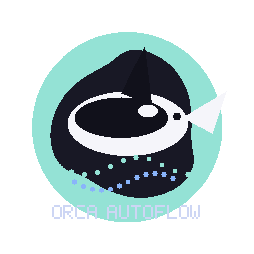
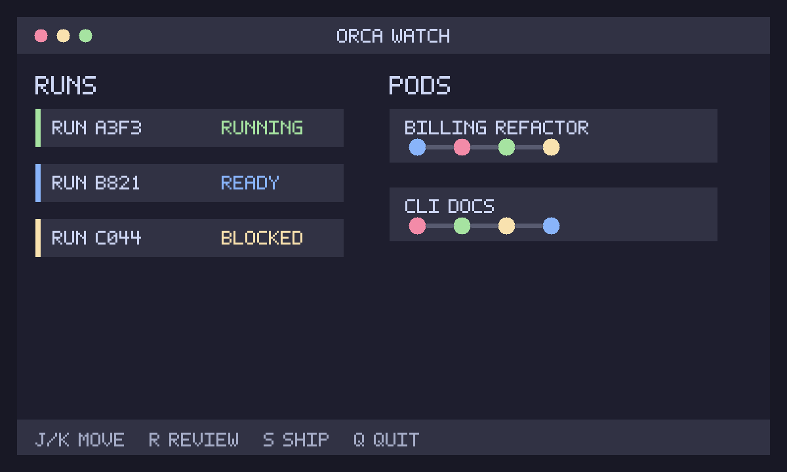
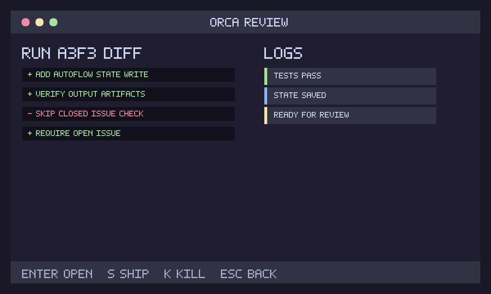
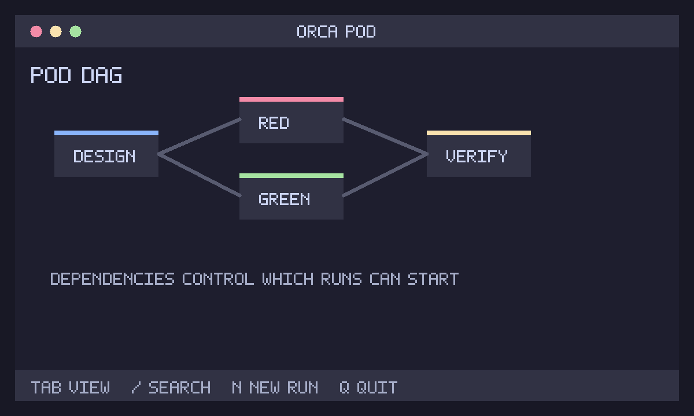

<div align="center">



# orca-autoflow

**The orchestration layer for AI coding agents**

*Hunt in pods. Single Go binary. Zero dependencies.*

[Quick Start](#quick-start) • [How It Works](#how-it-works) • [Commands](#commands) • [Agent Setup](#agent-setup) • [Why Not Symphony?](#why-not-symphony) • [TUI](#tui) • [Full Docs](DOCS.md)

</div>

---

> **orca-autoflow** `/ˈɔːr.kə/` — *biology*: an apex predator that hunts in coordinated pods. The only consistent natural enemy of the great white shark.

Each agent loses its entire run context the moment the session compacts. Orca holds the state — isolated worktrees, structured run logs, a DAG the agents can read and drive — so nothing gets lost between resets.

Orca is a **Go binary** that stores run state in SQLite, isolates every agent in its own git worktree, and exposes an MCP server so any agent can drive it or be driven by it. It works with **any agent** that supports MCP — Claude Code, Codex, Aider, OpenCode, Cursor, Windsurf, or anything else.

```
You (CLI, TUI, or MCP client)
    ↓
Orca (single Go binary)
    ├──→ Run state    →  ~/.orca/orca.db        (SQLite + FTS5)
    ├──→ Isolation    →  .orca/runs/<id>/       (git worktrees)
    └──→ Adapters     →  Claude Code · Codex · Aider · OpenCode · Cursor
                          (via MCP stdio)
```

No Node.js, no Python, no Docker. **One binary, one SQLite file, git worktrees you already understand.**

## Quick Start

### Homebrew (recommended)

Install via the tap — the fastest path to a working binary:

```sh
brew install orca-cli/tap/orca
```

### From source

Clone and install with a standard Go toolchain:

```sh
git clone git@github.com:Munsik-Park/orca-autoflow.git
cd orca-autoflow
go build -o ~/go/bin/orca-autoflow ./cmd/orca
```

### Binary download

Pre-built binaries are not published for this fork yet. Build from source and
place the `orca-autoflow` binary on `PATH`.

Then point the agent's MCP config at `orca mcp serve` — see [Agent Setup](#agent-setup) below.

## How It Works

#### The Agent Runs, Orca Orchestrates

The agent does the coding work; orca handles isolation, state tracking, and the review handoff. Each run gets a dedicated git worktree so parallel agents never touch the same branch. A pod decomposes a goal into a DAG of runs and queues them with dependency ordering — agents pick up work as upstream runs complete.

```
You: orca pod create "refactor billing module"
    ↓
Orca decomposes goal → builds DAG → 3 runs queued
    ↓
Each run gets its own git worktree
    ↓
Agents work in parallel, isolated, in their own branches
    ↓
Constraints gate what reaches review
    ↓
You: orca ship run_a3f3  →  PR opens against main
```

#### Run Lifecycle

Every run moves through the state machine below. A blocked run waits on an upstream dependency in the same pod. A failed run can be retried with feedback via `orca retry`.

```
queued → running → ready → shipped
            ↓        ↓
         blocked  failed → retry
```

#### CLI Commands

| Command | Purpose |
|---|---|
| `orca run` | Launch a single run with a goal and context |
| `orca pod create` | Create a pod and decompose a goal into a DAG of runs |
| `orca watch` | Live TUI showing every active run and pod |
| `orca ls` | List runs and pods, filterable by status |
| `orca review` | Open a run's diff, logs, tests, and context |
| `orca ship` | Ship a ready run as a pull request |
| `orca diff` | Show the diff for a run |
| `orca logs` | Stream agent logs in real time |
| `orca kill` | Cancel an active run, archive its worktree |
| `orca retry` | Relaunch a failed or killed run with feedback |
| `orca config` | Manage AGENTS.md, skills, policies per repo |
| `orca mcp serve` | Run Orca as an MCP server (stdio) |
| `orca-autoflow autoflow step` | Run one artifact-gated AutoFlow phase through an adapter |

The full CLI reference with flags is in [DOCS.md](DOCS.md).

### AutoFlow Step

The initial AutoFlow integration runs one phase at a time. It validates the
phase's required `.autoflow/` input artifacts, invokes the target repo's
`scripts/orca/codex-agent.sh`, validates required output artifacts, then writes
Orca-owned state to `.autoflow/issue-<N>-orca.json`.

```sh
orca-autoflow autoflow step \
  --target /path/to/project \
  --issue 123 \
  --phase red \
  --adapter codex \
  --prompt-file .autoflow/issue-123-red-prompt.md
```

When Codex is authenticated with a ChatGPT subscription, omit `--model` unless
you have verified the model is supported by that account. Orca then lets Codex
use its configured default model.

## Agent Setup

### Claude Code

Add the following to `~/.claude/settings.json`. For a project-scoped setup, use `.mcp.json` at the repo root instead — Claude Code checks both locations and the repo-level file takes precedence:

```json
{
  "mcpServers": {
    "orca": {
      "command": "orca-autoflow",
      "args": ["mcp", "serve"]
    }
  }
}
```

### OpenCode

Add to `~/.config/opencode/opencode.json` for a global setup, or `opencode.json` at the repo root to scope it to a single project:

```json
{
  "mcpServers": {
    "orca": {
      "command": "orca-autoflow",
      "args": ["mcp", "serve"]
    }
  }
}
```

### Codex

Add to `~/.codex/config.json`. Codex CLI reads MCP server definitions as JSON from this file, so the block below drops in directly:

```json
{
  "mcpServers": {
    "orca": {
      "command": "orca-autoflow",
      "args": ["mcp", "serve"]
    }
  }
}
```

### Cursor

Add to `.cursor/mcp.json` at the repo root for project-scoped access. For a global setup shared across all repos, use `~/.cursor/mcp.json` instead:

```json
{
  "mcpServers": {
    "orca": {
      "command": "orca-autoflow",
      "args": ["mcp", "serve"]
    }
  }
}
```

### Gemini CLI

Add to `~/.gemini/settings.json`. Gemini CLI picks up MCP servers from this file on startup:

```json
{
  "mcpServers": {
    "orca": {
      "command": "orca-autoflow",
      "args": ["mcp", "serve"]
    }
  }
}
```

### Windsurf

Add to `~/.codeium/windsurf/mcp_config.json`. Windsurf loads MCP server definitions from this global config file:

```json
{
  "mcpServers": {
    "orca": {
      "command": "orca-autoflow",
      "args": ["mcp", "serve"]
    }
  }
}
```

### Any other MCP agent

Any agent that reads MCP server definitions uses the same structure — add it wherever that agent expects its MCP config. The `command` field points to the `orca` binary already on `PATH`:

```json
{
  "mcpServers": {
    "orca": {
      "command": "orca-autoflow",
      "args": ["mcp", "serve"]
    }
  }
}
```

### Surviving Context Loss (Recommended)

Context windows compact, and when they do the agent loses all in-flight run state. The nuclear option is a directive in the agent's instruction file that survives every compaction — the agent reads it on every session start and re-establishes what it was doing.

This is not an optional best-practice note. Without it, a long-running pod will silently orphan its worktrees the moment the context rolls. Add the snippet that matches the agent:

Add to a project's `CLAUDE.md` or `~/.claude/CLAUDE.md`:

```markdown
## Orca persistence (mandatory)

On every session start: call `orca_list_runs` via MCP. Surface any active runs to me.
After every meaningful change: stage the worktree via `orca_stage` and route review through `orca_review`.
Never leave runs orphaned — kill or ship them before exiting.
```

Add this to the repo's `.orca/AGENTS.md`:

```markdown
## Orca run protocol

Every task starts with `orca run` or `orca pod create` — never edit main directly.
Worktree is yours; commit to your branch only.
When done, mark the run ready and exit — orca handles ship and review.
```

These are orders the agent must follow on every session start. Add the `CLAUDE.md` snippet for Claude Code, `AGENTS.md` for OpenCode/Codex/others, `.cursor/rules/orca.mdc` (with `alwaysApply: true`) for Cursor, and `.windsurfrules` for Windsurf.

## Why Not Symphony?

| | **Orca** | **Symphony** |
|---|---|---|
| **License** | MIT | Proprietary |
| **Agent lock-in** | None — any MCP agent | Limited |
| **Isolation** | git worktrees (native) | Custom sandboxing |
| **Storage** | Single SQLite file + git | Proprietary backend |
| **TUI** | Bubble Tea (`orca watch`) | Web only |
| **MCP server** | Built-in (`orca mcp serve`) | Not exposed |
| **Dependencies** | `go install` and done | Requires their cloud |
| **Cost** | Free (cloud tier optional) | Paid SaaS |

**The core philosophy difference**: Symphony hides orchestration behind their cloud. Orca treats orchestration as terminal-native, agent-agnostic infrastructure. The agent already has the LLM, the context, the judgment — Orca handles isolation, state, and review handoff. That's it.

Both tools solve the multi-agent coordination problem. The difference is where the boundary sits: Symphony draws it at their API, orca draws it at the local git repo.

## TUI

The Orca TUI is built with Bubble Tea on a Catppuccin Mocha palette. It runs in the terminal alongside the agent, showing live run and pod state without leaving the keyboard.

[](assets/tui-watch.png)

[](assets/tui-review.png)

[](assets/tui-pod.png)

**Sections**

- Watch — live view of all active runs and pods
- Pod View — DAG visualization for a pod in progress
- Review — diff, logs, and test output for a specific run
- New Run — inline goal entry without leaving the TUI

**Navigation**

- `j`/`k` — move up/down
- `r` — open review for the selected run
- `s` — ship a ready run
- `k` — kill the selected run
- `n` — create a new run
- `/` — search across runs and pods
- `Esc` — go back
- `q` — quit

**Features**

- Catppuccin Mocha palette throughout
- Live status updates without manual refresh
- Pulse animation on running runs
- Fully keyboard-driven — no mouse required

## Skills & AGENTS.md

The `.orca/` directory holds the per-repo configuration that every run loads: agent guidelines, skill documents, validation policies, and component templates.

```
.orca/
├── AGENTS.md         ← guidelines every run loads
├── orca.toml         ← project config
├── skills/           ← stack-specific patterns
│   ├── kotlin-spring.md
│   └── hexagonal.md
├── policies/         ← validation rules
│   └── arch-rules.yaml
└── templates/        ← new component templates
```

- `AGENTS.md` — instructions injected into every run at start; define coding conventions, review gates, and any repo-specific rules here
- `orca.toml` — project-level config: default agent adapter, concurrency limits, worktree cleanup policy
- `skills/` — Markdown files describing stack-specific patterns (e.g. hexagonal architecture, Spring Boot conventions) that agents load when relevant
- `policies/` — YAML rule files that `orca config validate` checks on each run before it ships
- `templates/` — starter files for new components; `orca run` injects matching templates into a run's context automatically

Run `orca config init` to scaffold the `.orca/` directory in any repo. `orca config validate` checks `AGENTS.md` and all active policies before a run is allowed to ship.

## Commands

The full CLI surface.

```
orca run <goal>                     Launch a single run
orca pod create <goal>              Create a pod with multiple coordinated runs
orca pod ls                         List active pods
orca watch                          Launch interactive TUI
orca ls                             List runs and pods
orca review <run-id>                Open review screen for a run
orca ship <run-id>                  Ship a ready run as a pull request
orca diff <run-id>                  Show the diff produced by a run
orca logs <run-id>                  Stream the run's agent logs
orca kill <run-id>                  Cancel an active run
orca retry <run-id>                 Relaunch a failed/killed run with feedback
orca config init                    Scaffold .orca/ in current repo
orca config validate                Check AGENTS.md and policies
orca mcp serve                      Start MCP server (stdio transport)
orca-autoflow version                        Show version
```

## License

MIT — see [LICENSE](LICENSE).

**Pairs naturally with [Engram](https://github.com/Gentleman-Programming/engram)** for persistent memory across runs and sessions. Engram gives each agent a searchable brain that survives context resets; orca gives it an isolated worktree and a structured review gate. The two tools compose cleanly over MCP.

Issues and PRs welcome — see [CONTRIBUTING.md](CONTRIBUTING.md).

---

*orca is in active development — interfaces may shift before v1.0.*
